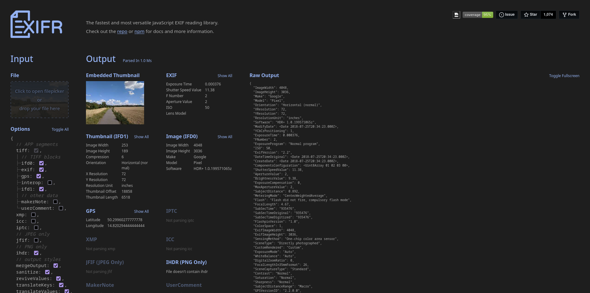

# Conceptualization

Around the time I had the idea to make a website that reads image metadata, I drew out what I wanted the website to look like.

I knew I wanted the website to be built using React, as before this, I only made React projects for my certification on the freeCodeCamp website. I wanted to see how it would be to use it in a more typical environment.

I also knew I wanted to have multiple components in separate files interacting with one another. This was because my previous projects for freeCodeCamp had to be done all in one file. In the end, I didn't do this as much as I thought I would have. I probably could have done it more if I used a state management library, but I could get away with not using it for now, so I did not.

# Setup and Creating The Project

I remember I had an issue deploying React in a way I understood. On freeCodeCamp, I made a div in the html file that the entire React file would use to display everything. I used Vite to create the project, and it had a main.jsx file that  everything went into. I wanted to use several files and it wasn't immediately clear to me how I was supposed to do this. 

I used a script file to put the main.jsx file into the html, so anything that wasn't main.jsx, would be used within that same file. I had a SideContent and MainContent file that I called inside the return of that main.jsx file. 

# SideContent and MainContent 

SideContent would be for selecting options and uploading the image, while MainContent would display the image metadata. My idea for the MainContent involved having alternating background colors for each line. From some surface-level research, it was recommended I look into a WYSIWYG (What You See Is What You Get) Text Editor to insert into the file to get more customization. 

I attempted a few of them, but none of them quite offered the customization I was looking for, at least not easily. After trying and failing to implement 5 of them in a way I was satisfied with, I attempted to brute-force a solution using a textarea.

Maybe I could use an image? That isn't easily scalable, however. I think it was my best option though. I found a stackOverflow post suggesting maybe I could use a linear gradient as the background, that switched between each color at the same length as the size of the font. 

This solution has some problems however. It is somewhat difficult to make the font fit perfectly within the lines, even when the alignment of each line was perfect. Generally speaking though, this was what I was looking for as my solution. It works and does what I want.

# AcceptImage function

I needed to have an input that would accept the image thats uploaded by the user. This was a bit harder than I was expecting, because I wanted full control over what the button would look like, alongside putting the file name somewhere else that I wanted more control over. 

I achieved this after finding another stackOverflow post that gave me a decent solution. It involved creating a couple of refs and a separate button that, when clicked, would simulate a click on an invisible input tag. All of this could be done with refs as it could accept the file name without refreshing the entire page. 

# Choosing [EXIFR](https://github.com/MikeKovarik/exifr)

Once I had image thumbnails appearing on screen, I went ahead and did research on what Javascript library would be the most appropriate for parsing typical image file formats, such as JPEG and PNG. 

I initially found a library called [exif-js](https://github.com/exif-js/exif-js), but I passed on it for a few reasons.

1. This library was very old. It did have a commit 8 months ago to fix a typo, but that is the newest commit since their last commit in 2018.
2. No live demonstration on how it worked. 
3. Seemingly little documentation? 

I wanted a bit more from a library covering things I did not fully understand yet. After checking a StackOverflow post, I stumbled upon [EXIFR](https://github.com/MikeKovarik/exifr).

It has a lot of different features, demonstrations to choose from on their website, seemingly easy to use, but on a funnier note...

*oh this layout seems familiar lol*

This isn't a big deal or anything, but I wouldn't lie if I said I worried a little. I didn't want to be interpreted as a copy-cat or giving people the impression I was copying this website. I tried telling myself that I didn't know about this website until I did researching just recently, so it really shouldn't be an issue.

# Addressing the SubmitImage function

I had to address the fact that the imageFile state seemingly did not update after setting it? No matter where I put console.logs, it was null. 

After checking more console.logs, I found a similar pattern as I noticed in the AcceptImage function. After uploading an image, I noticed that some console.logs that were otherwise null, would display the proper information from the *previous* image.

I still couldn't properly figure out how to address this though. Maybe it needed another render? I believe thats what helped the AcceptImage function as well. I discussed it with a friend who has vague knowledge of React and they recommended I try a hook to achieve this. useEffect was what helped me here, as watching specifically for the imageFile state to change allowed the console.logs to display the proper information. 

Thusly, I was able to successfully send the information that was needed to the ParseImage file, which is where all the logic for parsing metadata will go!

# Drag and Drop

For this part, I used the [react-dropzone package](https://react-dropzone.js.org/). Luckily, this wasn't very complicated. I created a function for the dropzone, and moved my existing code for the div and everything inside it, into the return part of the function. I could then execute the dropzone function where the old div was thanks to react.

# Removing EXIF Data

Removing EXIF Data would be very useful given that is often where sensitive information is held. I found a package called [exif-be-gone](https://github.com/joshbuddy/exif-be-gone#readme). However, this turned out to be a package that was expected to be ran server-side, and I unfortunately don't know enough about the backend in order to run something like that. I had to make a [forum post](https://forum.freecodecamp.org/t/having-trouble-with-require/730409) for help regarding the issue, and is how I found out. I do plan on learning the backend, but learning it for this project seemed like not the best time investment. I narrowed my search to two potential packages.

I had to choose between a package called [exif-js](https://github.com/exif-js/exif-js) and [Compressor.js](https://www.npmjs.com/package/compressorjs)... wait a minute. 

Exif.js is the package I initially passed on before, but it as well as Compressor.js can remove EXIF data from client-side. These were the best options I had. 

Initially, I went with the first option, not realizing this was in fact the same package I passed on before! It caused a lot of issues, with mostly the .js file it was referencing to exectute the logic constantly failing with common issues, like not including the let keyword when setting up a for loop. I kept trying to fix these errors, but I also had issues editing code that was in node_modules. It overwrites my changes whenever I need to update packages.

I found a [StackOverflow post](https://stackoverflow.com/questions/13300137/how-to-edit-a-node-module-installed-via-npm) about this topic specifically, and the option to install a package called [patch-package](https://www.npmjs.com/package/patch-package) to patch the npm dependency I wanted to use, seemed really useful. This sounded like a better idea to me compared to forking the project just to make a couple of changes. I wanted to see if maybe this would be an easy option instead of switching to a different package that might have its own issues.

I took a bit to think about it regardless. My partner convinced me it would probably be easier to attempt to use a different package instead, given I did have an option. Just to see what would happen, I attempted to use the Compressor.js package to remove the data, and I was able to get it working decently quickly. I laugh now thinking about how I was willing to do so much work to accomplish something that another package could do without much effort lmao.

Finally! My website was starting to look feature complete. I knew despite this, I still needed to update my imageFile state in order to account for the new image without the EXIF data. This was a bit harder than I was expecting. I couldnt use setImageFile as even though I was calling for it to execute from my SideContent file, the RemoveExif file could not access the states in the SideContent file. 

The easiest solution to this problem would be to move the content of the RemoveExif file over to my SideContent file. After attempting this and getting it working without calling the ParseImage file, I could remove most of the logic written in the Compressor function (which admittedly wasn't a lot to begin with), and it could now fit comfortably within my larger file.

# Export Button

I thought at first I could insert the imageFile state call into the href and it would point to my file to download without issue. However, when I clicked the button, it attempted to download the Blob Object as an HTML file. If I wanted to allow the user to download the edited image, I needed that Blob Object to be the same file type that was originally uploaded by the user. 

For this, I decided to try something I hadn't tried before. After trying to find the answer and not quite getting what I was looking for, I tried asking ChatGPT. I asked something along the lines of "how would I allow the user to download a file that they uploaded to a website, after I made changes to that file?" and it gave me a surprisingly detailed answer. 

I asked it to focus on a specific step of the process that it laid out. I said "I have a question regarding the third step. I am trying to let the user download a file I have stored in a react state. Could I point the href to that state to allow the user to download it" and it also gave a very helpful answer.

It said that I couldn't do that because the file exists as an object that the user wouldn't be able to access unless I created a URL for a blob. It gave me an example of this in action and I took from it to implement the download function. 

Despite this, the answer ChatGPT gave me wasn't perfect, and I could tell that it wasn't before I started taking from it's example. I took it one line at a time, and implemented only what I thought was needed. If it behaved in a way I didn't expect, I changed it to work properly. It actually wasn't all that bad of a process, and gives me reassurance that ChatGPT won't be an issue in the future if I am able to judge it's answers before I implement them.