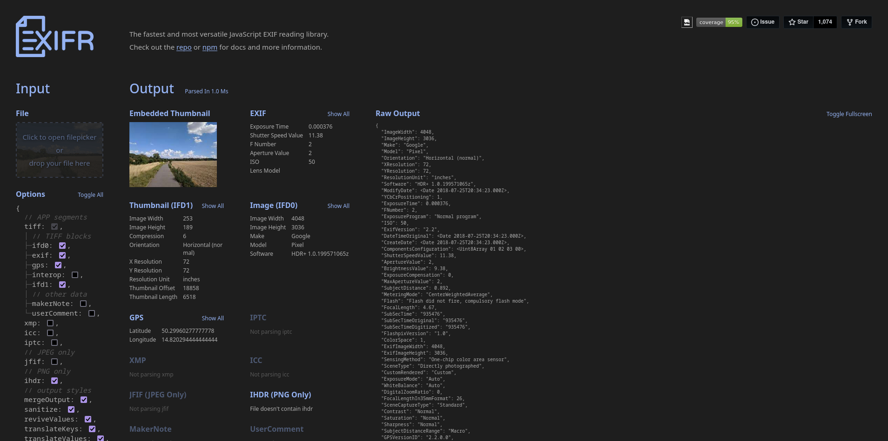

# Adding [EXIFR](https://github.com/MikeKovarik/exifr)

Once I had image thumbnails appearing on screen, I went ahead and did research on what Javascript library would be the most appropriate for parsing typical image file formats, such as JPEG and PNG. 

I initially found a library called [exif-js](https://github.com/exif-js/exif-js), but I passed on it for a few reasons.

1. This library was very old. It did have a commit 8 months ago to fix a typo, but that is the newest commit since their last commit in 2018.
2. No live demonstration on how it worked. 
3. Seemingly little documentation? 

I wanted a bit more from a library covering things I did not fully understand yet. After checking a StackOverflow post, I stumbled upon [EXIFR](https://github.com/MikeKovarik/exifr).

It has a lot of different features, demonstrations to choose from on their website, seemingly easy to use, but on a funnier note...

*oh this layout seems familiar lol*